# rps-cv
A Rock-Paper-Scissors game using computer vision and machine learning on Raspberry Pi.

By Julien de la Bruère-Terreault (drgfreeman@tuta.io)

[](https://www.youtube.com/watch?v=ozo0-lx_PMA)  
Click on image to access [video on YouTube](https://www.youtube.com/watch?v=ozo0-lx_PMA).

#### This project is [showcased](https://www.raspberrypi.org/magpi-issues/MagPi74.pdf#%5B%7B%22num%22%3A272%2C%22gen%22%3A0%7D%2C%7B%22name%22%3A%22FitH%22%7D%2C787%5D) in [issue 74](https://www.raspberrypi.org/magpi/issues/74/)  of the MagPi, the official magazine of the [Raspberry Pi Foundation](https://www.raspberrypi.org/).

* See my [DrGFreeman/rps-cv-data-science](https://github.com/DrGFreeman/rps-cv-data-science) repository where I posted different notebooks demonstrating some cool data science analysis on the image dataset resulting from this project.

* [MagPi article in Simplified Chinese](https://github.com/TommyZihao/MagPi_Chinese/blob/master/MagPi74_18-19%E7%94%A8%E6%A0%91%E8%8E%93%E6%B4%BE%E8%B7%9F%E4%BA%BA%E5%B7%A5%E6%99%BA%E8%83%BD%E7%8E%A9%E7%8C%9C%E6%8B%B3.md) contributed by [Tommy Zihao](https://github.com/TommyZihao)

## Summary

### Project origin

This project results from a challenge my son gave me when I was teaching him the basics of computer programming making a simple text based Rock-Paper-Scissors game in Python. At that time I was starting to experiment with computer vision with a Raspberry Pi and an old USB webcam so my son naively asked me:

*"Could you make a Rock-Paper-Scissors game that uses the camera to detect hand gestures?"*

I accepted the challenge and about a year and a lot of learning later, I completed the challenge with a functional game.

### Overview of the game

The game uses a Raspberry Pi computer and Raspberry Pi camera installed on a 3D printed support with LED strips to achieve consistent images.

The pictures taken by the camera are processed and fed to an image classifier that determines whether the gesture corresponds to "Rock", "Paper" or "Scissors" gestures.

The image classifier uses a [Support Vector Machine](https://en.wikipedia.org/wiki/Support_vector_machine), a class of [machine learning](https://en.wikipedia.org/wiki/Machine_learning) algorithm. The image classifier has been priorly "trained" with a bank of labeled images corresponding to the "Rock", "Paper", "Scissors" gestures captured with the Raspberry Pi camera.

### How it works

The image below shows the processing pipeline for the training of the image classifier (top portion) and the prediction of gesture for new images captured by the camera during the game (bottom portion). Click [here](https://raw.githubusercontent.com/DrGFreeman/rps-cv/master/img/doc/rps-pipeline.png) for full size image.
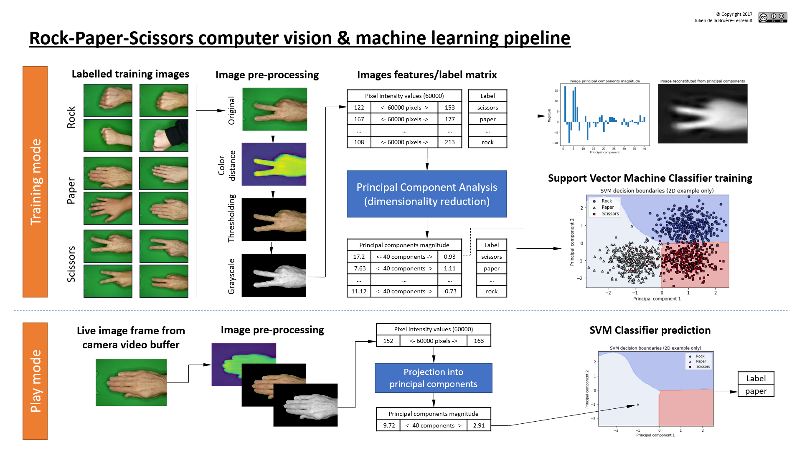

## Dependencies

The project depends on and has been tested with the following libraries:

* OpenCV >= 3.3.0 with bindings for Python 3*
* Python >= 3.4+
* Numpy >= 1.13.0
* Scikit-Learn >= 0.18.2
* Scikit-Image >= 0.13.0
* Pygame >= 1.9.3
* Picamera

\* Follow [this guide](https://www.pyimagesearch.com/2016/04/18/install-guide-raspberry-pi-3-raspbian-jessie-opencv-3/) for installation of OpenCV on the Raspberry Pi. Install Python libraries within the same virtual environment as OpenCV using the `pip install <package_name>` command. Picamera is installed by default on [Raspbian](https://www.raspberrypi.org/downloads/raspbian/) images.

### Hardware:

* [Raspberry Pi 3 Model B or B+ computer](https://www.raspberrypi.org/products/raspberry-pi-3-model-b-plus/)
* [Raspberry Pi Camera Module V2](https://www.raspberrypi.org/products/camera-module-v2/)
* A green background to allow background subtraction in the captured images.
* A physical setup for the camera to ensure consistent lighting and camera position. The 3D models I used are available [on Thingiverse](https://www.thingiverse.com/thing:2598378).


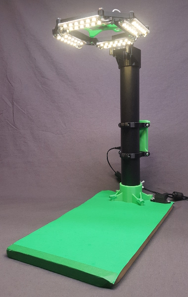
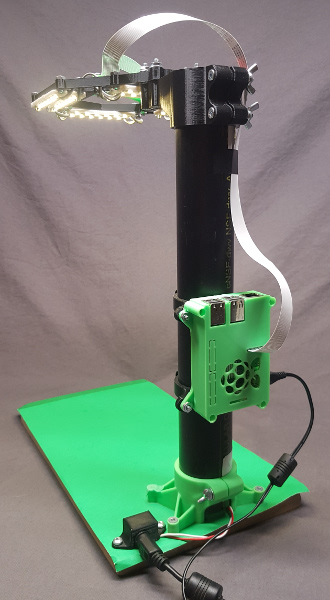
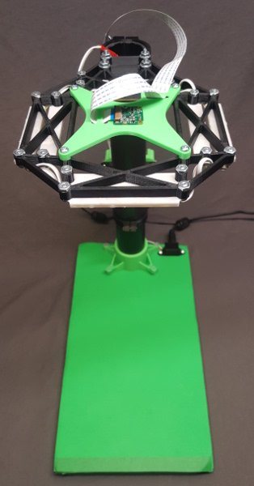

## Program files

* *capture.py*  
This file opens the camera in "capture mode", to capture and label images that will later be used to train the image classifier. The captured images are automatically named and stored in a folder structure.

* *train.py*  
This script reads and processes the training images in preparation for training the image classifier. The processed image data is then used to train the support vector machine image classifier. The trained classifier is stored in the `clf.pkl` file read by `play.py`.

* *playgui.py*  
This file runs the actual Rock-Paper-Scissors game using the camera and the trained image classifier in a graphical user interface (GUI). Images from each play are captured and added to the image bank, creating additional images to train the classifier.

* *play.py*  
This file runs the actual Rock-Paper-Scissors game similarly to playgui.py except the game output is done in the terminal and OpenCV window (no GUI).

\* Note that the due to memory limitations on the Raspberry Pi, the *train.py* script may not run properly on the Raspberry Pi with training sets of more than a few hundred images. Consequently, it is recommended to run these on a more powerful computer. This computer must also have OpenCV, Python 3.4+ and the numpy, scikit-learn and scikit-image Python libraries installed.

## Library modules

* *rpscv.gui*  
This module defines the RPSGUI class and associated methods to manage the game
 graphical user interface (GUI).

* *rpscv.imgproc*  
This module provides the image processing functions used by the various other Python files.

* *rpscv.utils*  
This module provides functions and constants used by the various other Python files.

* *rpscv.camera*  
This module defines the Camera class, a wrapper around the picamera library, with specific methods for the project such as white balance calibration.

## Ouput & Screenshots

### Training mode

Typical output from *train.py* (on PC with Intel Core I7-6700 @3.4GHz, 16GB RAM, Anaconda distribution):
```
(rps-cv) jul@rosalind:~/pi/git/rps-cv$ python train.py
+0.0: Importing libraries
+3.75: Generating image data
Completed processing 1708 images
  rock: 562 images
  paper: 568 images
  scissors: 578 images
+99.51: Generating test set
+99.64: Defining pipeline
+99.64: Defining cross-validation
+99.64: Defining grid search
Grid search parameters:
GridSearchCV(cv=StratifiedKFold(n_splits=5, random_state=42, shuffle=True),
       error_score='raise',
       estimator=Pipeline(steps=[('pca', PCA(copy=True, iterated_power='auto', n_components=None,
       random_state=None, svd_solver='auto', tol=0.0, whiten=False)), ('clf', SVC(C=1.0,
       cache_size=200, class_weight=None, coef0=0.0, decision_function_shape=None, degree=3,
       gamma='auto', kernel='rbf', max_iter=-1, probability=False, random_state=None, shrinking=True,
       tol=0.001, verbose=False))]),
       fit_params={}, iid=True, n_jobs=4,
       param_grid={'clf__C': array([   1.     ,    3.16228,   10.     ,   31.62278,  100.     ]),
                   'clf__gamma': array([ 0.0001 ,  0.00032,  0.001  ,  0.00316,  0.01   ]),
                   'pca__n_components': [60]},
       pre_dispatch='2*n_jobs', refit=True, return_train_score=True,
       scoring='f1_micro', verbose=1)
+99.64: Fitting classifier
Fitting 5 folds for each of 25 candidates, totalling 125 fits
[Parallel(n_jobs=4)]: Done  42 tasks      | elapsed:  2.1min
[Parallel(n_jobs=4)]: Done 125 out of 125 | elapsed:  5.9min finished
Grid search best score: 0.9910406616126809
Grid search best parameters:
  pca__n_components: 60
  clf__C: 10.0
  clf__gamma: 0.00031622776601683794
+458.66: Validating classifier on test set
Classifier f1-score on test set: 0.9922178988326849
Confusion matrix:
[[84  1  0]
 [ 1 84  0]
 [ 0  0 87]]
Classification report:
             precision    recall  f1-score   support

       rock       0.99      0.99      0.99        85
      paper       0.99      0.99      0.99        85
   scissors       1.00      1.00      1.00        87

avg / total       0.99      0.99      0.99       257

+458.72: Writing classifier to clf.pkl
+467.25: Done!
```

### Play mode with Graphical User Interface (*playgui.py*)

Initial screen:  
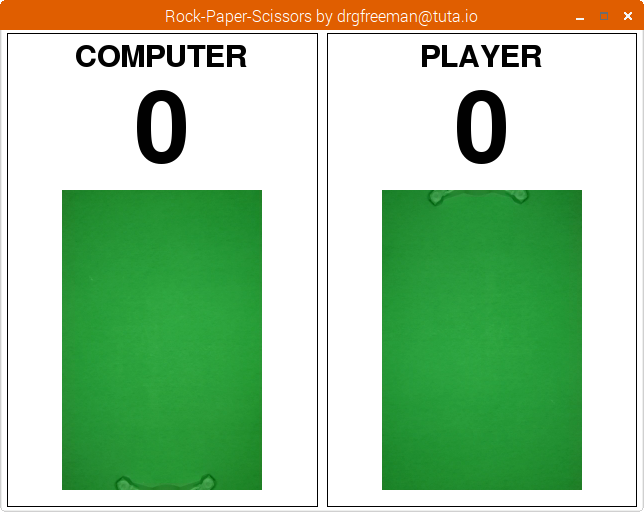

Computer wins the play:  
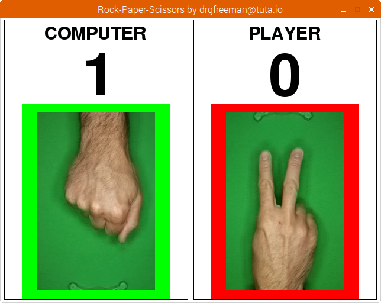

Player wins the play:  
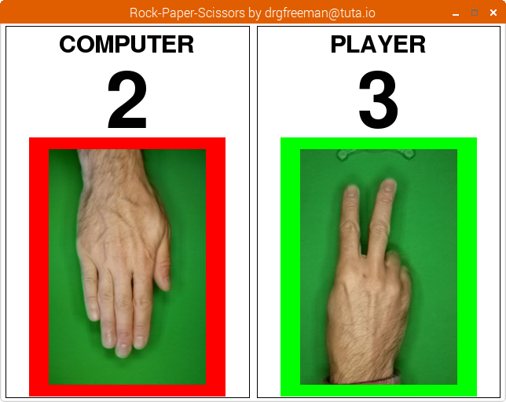

Tie:  
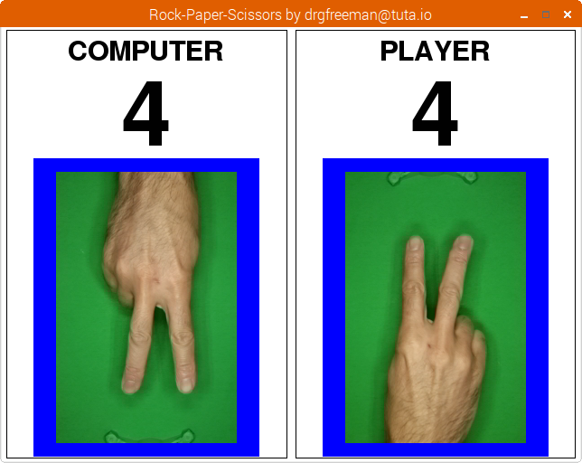

Game over, player wins the game:  
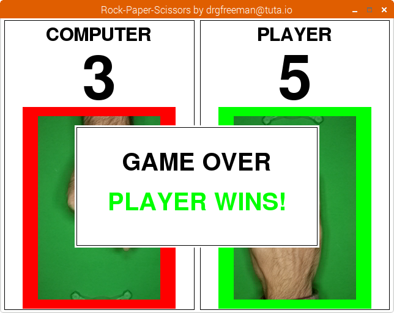

### Image capture mode (*capture.py*)
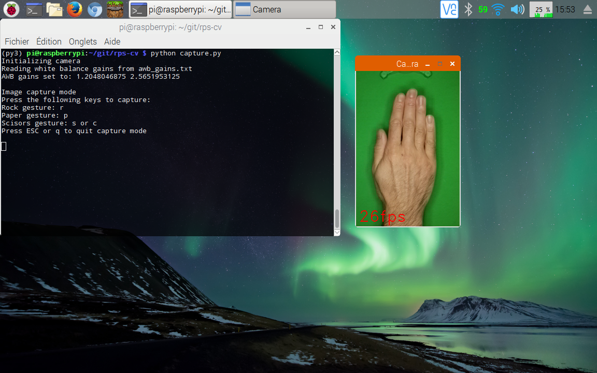

### Play mode without GUI (*play.py*)
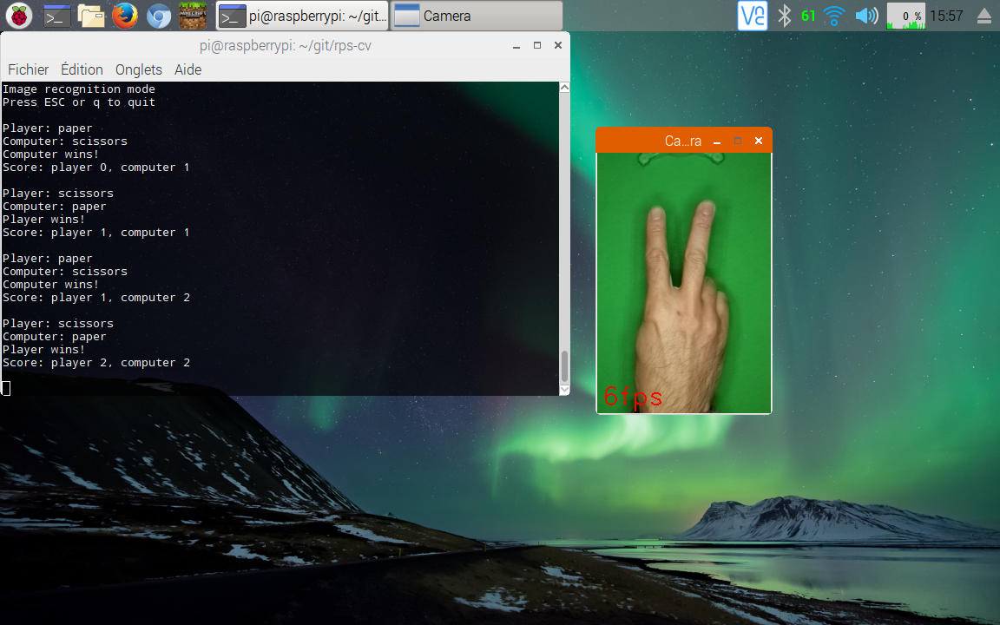
